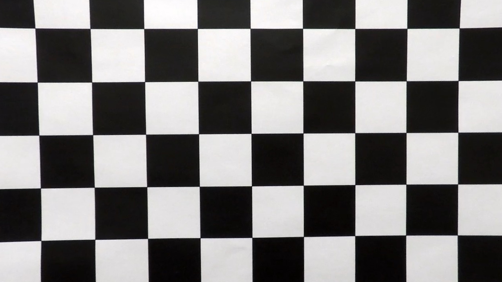
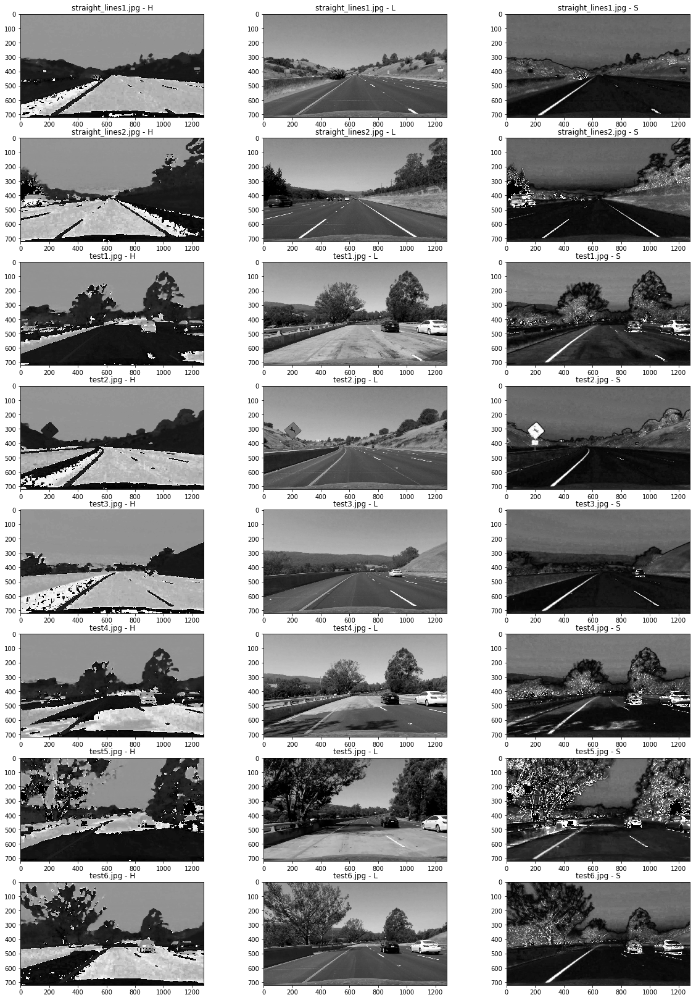

## Advanced Lane Finding Project

---

### Overview
This writeup shall describe what I have achieved for the Advanced Lane Lines detection task. I spent over 50 hours on it, and despite a promising start, did not manage to achieve good results for the challenge videos. You shall find a brief overview of my approaches and descriptions of both things that worked and those that didn't work.

#### Project Goals
* Compute the camera calibration matrix and distortion coefficients given a set of chessboard images.
* Apply a distortion correction to raw images.
* Use color transforms, gradients, etc., to create a thresholded binary image.
* Apply a perspective transform to rectify binary image ("birds-eye view").
* Detect lane pixels and fit to find the lane boundary.
* Warp the detected lane boundaries back onto the original image.
* Determine the curvature of the lane and vehicle position with respect to center.
* Output visual display of the lane boundaries and numerical estimation of lane curvature and vehicle position.

#### Set Up
As with every project, I started off by tidying up a bit. I've created a **data** folder to hold all the given data files and the **notebooks** folder for all my investigations. I'm a fan of keeping everything modular, so I may decide to have different notebooks for different components of the project. I have also decided to extract certain parts of my project into python modules, which you can find in the **src** folder. Overall, the layout should resemble the one proposed [Cook Cutter Data Science](https://drivendata.github.io/cookiecutter-data-science/).

#### General Approach
I started off by examining differnet parts of the pipeline, each in a separate notebook. Ultimately, despite figuring out what each part does, the majority on the project involved putting everything together and then tuning hyperparameters. This proved to bea easier on all videos at once (since I was aiming for success on at least once challenge video.). Ultimately, I ended up generating about 8GB of video data, with different combinations of threshold parameters. This overshadowed any initial explorations.

As mentioned just now, having completed the initial exploration of the different parts, I bundled everything together into a Final Notebook and continued experimenting on different hyperparameters in it.

## [Rubric](https://review.udacity.com/#!/rubrics/571/view) Points

### Here I will consider the rubric points individually and describe how I addressed each point in my implementation.  

---

### Writeup / README
Problems faced, failure cases and possible improvements shall be discussed within each section.

### Camera Calibration

#### 1. Briefly state how you computed the camera matrix and distortion coefficients. Provide an example of a distortion corrected calibration image.

The code for this step can be found in both "./notebooks/Camera Calibration.ipynb" notebook. Here, I save the matrices for later use. This allows me to load them every time I want to undistrot the image. This is done using the `apply_precomputed_undistortion` function in the Final Notebook.

In terms of implementation, there's not much variation here - I calibrated the camera in the same way as is usually done in the industry:

I start by preparing "object points", which will be the (x, y, z) coordinates of the chessboard corners in the world. Here I am assuming the chessboard is fixed on the (x, y) plane at z=0, such that the object points are the same for each calibration image. Thus, `objp` is just a replicated array of coordinates, and `objpoints` will be appended with a copy of it every time I successfully detect all chessboard corners in a test image.  `imgpoints` will be appended with the (x, y) pixel position of each of the corners in the image plane with each successful chessboard detection.  

I then used the output `objpoints` and `imgpoints` to compute the camera calibration and distortion coefficients using the `cv2.calibrateCamera()` function. I applied this distortion correction to the test image using the `cv2.undistort()` function and obtained this result: 

<figure>
	

		
		
		<figcaption>Distorted and Undistorted chessboard examples</figcaption>
	

</figure>

### Pipeline (single images)

#### 1. Provide an example of a distortion-corrected image.

To demonstrate this step, I will describe how I apply the distortion correction to one of the test images like this one:

#### 2. Describe how (and identify where in your code) you used color transforms, gradients or other methods to create a thresholded binary image.  Provide an example of a binary image result.

Color transformations, gradients and the combinations of the two, was my largest area of experimentation.

First of all, I analyzed all color channels available to me in "./notebooks/Color Detection and Thresholding.ipynb" notebook. Here, I plotted Red, Green, Blue, Hue, Saturation, Lightness and Value channels next to each other. This let me gain a decent understanding in what I can expect from each of those. Then, in the same notebook, I explored different kinds of thresholding - color-based, gradient direction-based, gradient magnitude-based and their combinations.

<figure>
	

		
		<figcaption>An example plot of HLS channels. I encourage the reader to open up the Color Detection and Thresholding notebook as it has more visualizations like this.</figcaption>
	

</figure>

#### 3. Describe how (and identify where in your code) you performed a perspective transform and provide an example of a transformed image.

Perspective transform allows to view the road from a top-down perspective. This helps detect lines better, specifically in the distance. This is also a prerequisite for more advanced techniques of merging lane pixels into lines.

To warp the perspective, I opened an arbitrary image editing program and found pixel coordinates for points I want to crop the image to. The resulting points are:

-----------------

This resulted in the following source and destination points:

| Source        | Destination   | 
|:-------------:|:-------------:| 
| 585, 460      | 320, 0        | 
| 203, 720      | 320, 720      |
| 1127, 720     | 960, 720      |
| 695, 460      | 960, 0        |

I verified that my perspective transform was working as expected by drawing the `src` and `dst` points onto a test image and its warped counterpart to verify that the lines appear parallel in the warped image.

![alt text][image4]

#### 4. Describe how (and identify where in your code) you identified lane-line pixels and fit their positions with a polynomial?

Then I did some other stuff and fit my lane lines with a 2nd order polynomial kinda like this:

![alt text][image5]

#### 5. Describe how (and identify where in your code) you calculated the radius of curvature of the lane and the position of the vehicle with respect to center.

I did this in lines # through # in my code in `my_other_file.py`

#### 6. Provide an example image of your result plotted back down onto the road such that the lane area is identified clearly.

I implemented this step in lines # through # in my code in `yet_another_file.py` in the function `map_lane()`.  Here is an example of my result on a test image:

![alt text][image6]

---

### Pipeline (video)

#### 1. Provide a link to your final video output.  Your pipeline should perform reasonably well on the entire project video (wobbly lines are ok but no catastrophic failures that would cause the car to drive off the road!).

Here's a [link to my video result](./project_video.mp4)

---

### Discussion

#### 1. Briefly discuss any problems / issues you faced in your implementation of this project.  Where will your pipeline likely fail?  What could you do to make it more robust?

Here I'll talk about the approach I took, what techniques I used, what worked and why, where the pipeline might fail and how I might improve it if I were going to pursue this project further.  
