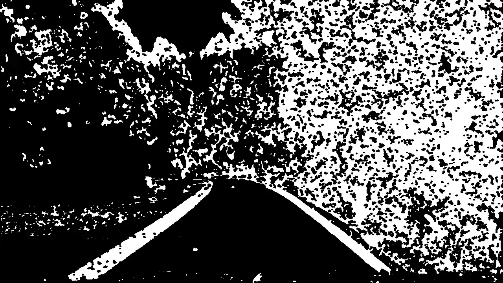
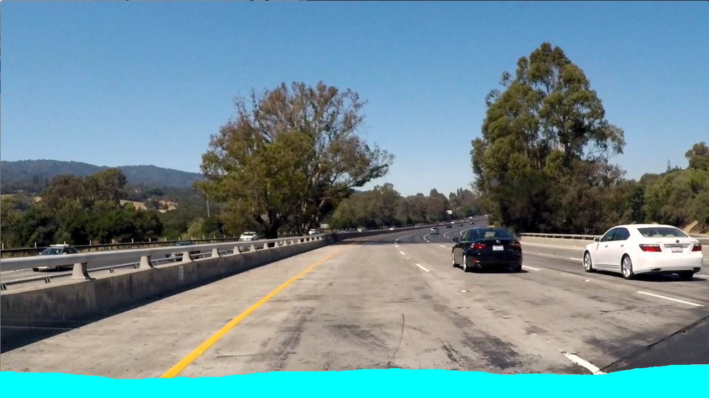
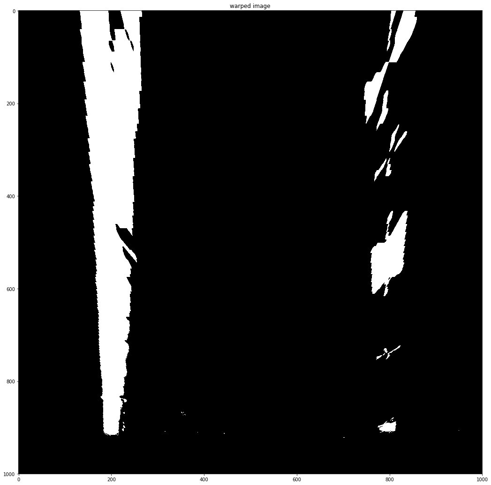
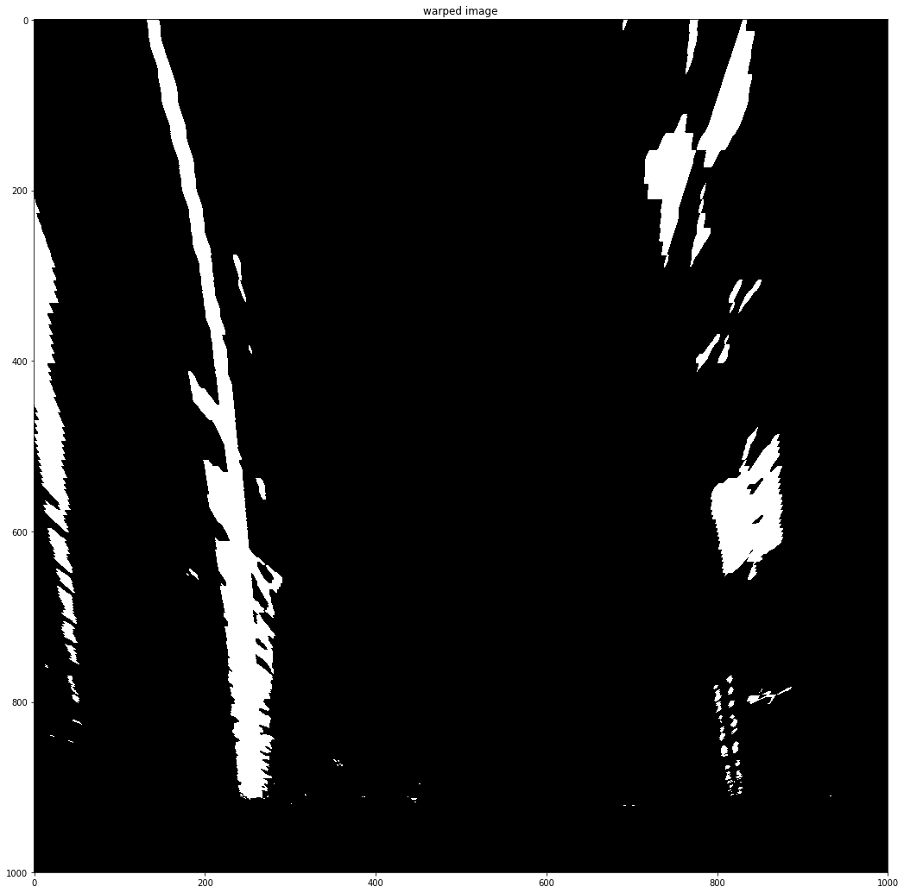
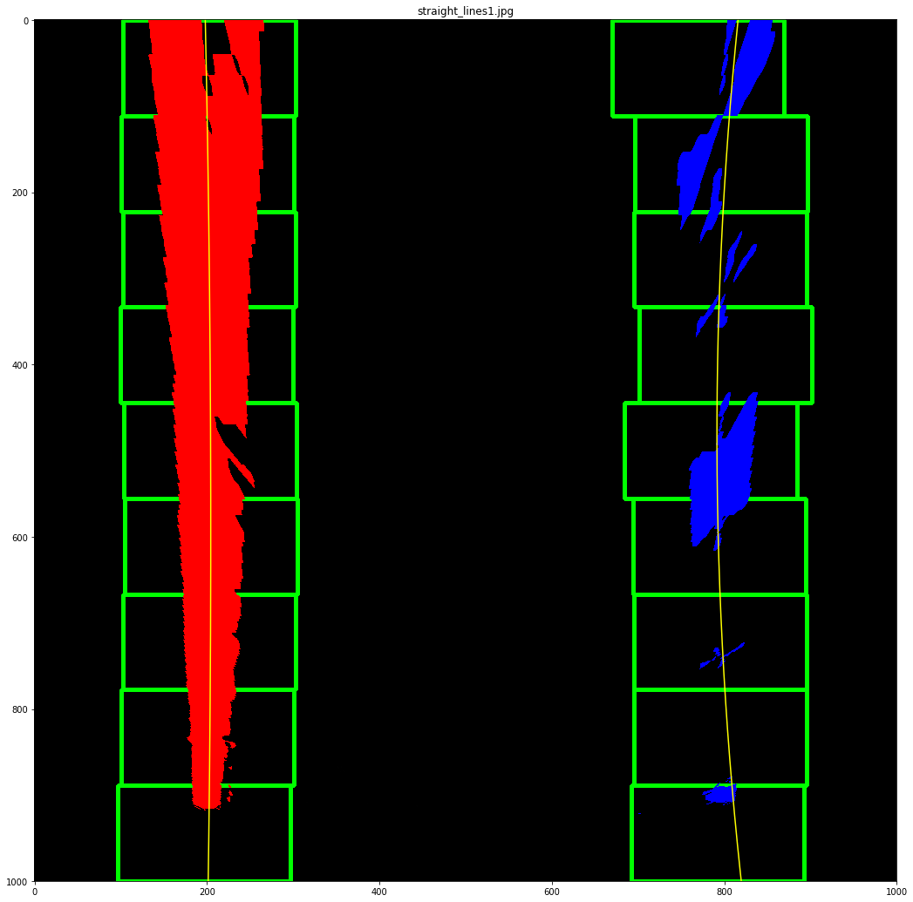
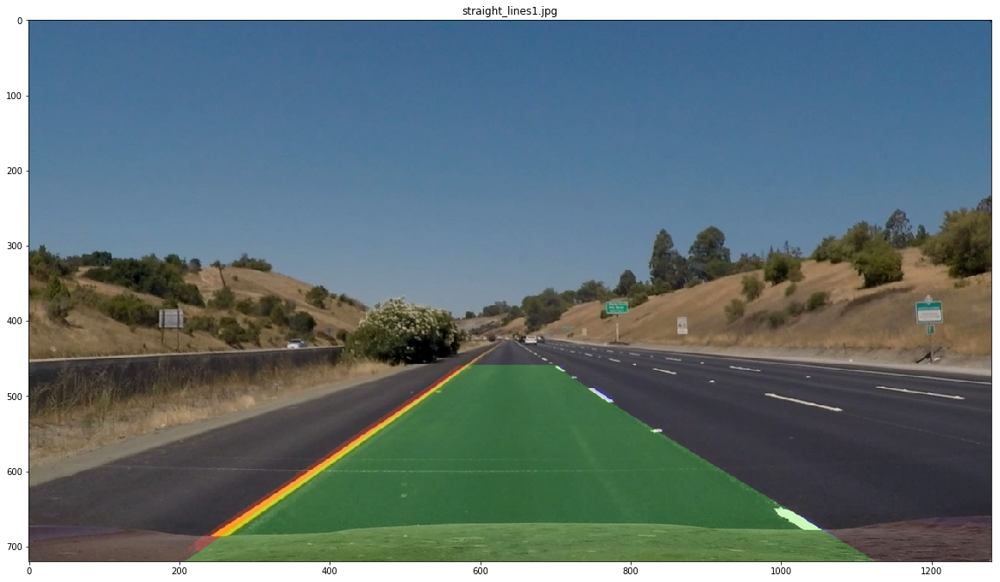

## Advanced Lane Finding Project

---

### Overview
This writeup shall describe my progress and results of the Advanced Lane Lines detection project.

#### Project Goals
* Compute the camera calibration matrix and distortion coefficients given a set of chessboard images.
* Apply a distortion correction to raw images.
* Use color transforms, gradients, etc., to create a thresholded binary image.
* Apply a perspective transform to rectify binary image ("birds-eye view").
* Detect lane pixels and fit to find the lane boundary.
* Warp the detected lane boundaries back onto the original image.
* Determine the curvature of the lane and vehicle position with respect to center.
* Output visual display of the lane boundaries and numerical estimation of lane curvature and vehicle position.

#### Set Up
As with every project, I started off by tidying up a bit. I've created a **data** folder to hold all the given data files and the **notebooks** folder for all my investigations. I'm a fan of keeping everything modular, so I may decide to have different notebooks for different components of the project. Generally, the layout should resemble the one proposed [Cook Cutter Data Science](https://drivendata.github.io/cookiecutter-data-science/).

#### General Approach
I started off by examining different parts of the pipeline, each in a separate notebook. Chronologically, these are the names of the notebooks I created at this stage:

* Camera Calibration
* Color Detection and Thresholding
* Perspective Transform
* Line Curvature Detection
* Projecting Lines Back Onto the Road

Ultimately, despite figuring out what each part does, the majority on the project involved putting everything together and tuning hyperparameters. This proved to be easier on all videos at once (since I was aiming for success on at least once challenge video.). You can find all resulting work in the **Final Notebook.ipynb** file. Moreover, for a historical perspective, feel free to look at the commit history, since a lot of code ended up not getting used and was removed for the sake of readability. Ultimately, I ended up generating about 8GB of video data, with different combinations of threshold parameters. This overshadowed any initial explorations that I carried out in other notebooks.

## [Rubric Points](https://review.udacity.com/#!/rubrics/571/view)

### Here I will consider the rubric points individually and describe how I addressed each point in my implementation.  

---

### Writeup / README
Problems faced, failure cases and possible improvements shall be discussed within each section.

### Camera Calibration

#### 1. Briefly state how you computed the camera matrix and distortion coefficients. Provide an example of a distortion corrected calibration image.

The code for this step can be found in both "./notebooks/Camera Calibration.ipynb" notebook. In terms of implementation, there's not much variation here - I calibrated the camera in the same way as is usually done in the industry:

I start by preparing "object points", which will be the (x, y, z) coordinates of the chessboard corners in the world. Here I am assuming the chessboard is fixed on the (x, y) plane at z=0, such that the object points are the same for each calibration image. Thus, `objp` is just a replicated array of coordinates, and `objpoints` will be appended with a copy of it every time I successfully detect all chessboard corners in a test image.  `imgpoints` will be appended with the (x, y) pixel position of each of the corners in the image plane with each successful chessboard detection.  

I then used the output `objpoints` and `imgpoints` to compute the camera calibration and distortion coefficients using the `cv2.calibrateCamera()` function. I applied this distortion correction to the test image using the `cv2.undistort()` function and obtained this result: 

<figure>
	

		
		
		<figcaption>Distorted and Undistorted chessboard examples</figcaption>
	

</figure>

I then save the matrices for later use. This allows me to load them every time I want to undistort the image. This is done using the `apply_precomputed_undistortion` function in the Final Notebook.

### Pipeline (single images)

#### 1. Provide an example of a distortion-corrected image.

Using the saved distortion data I am able to correct a distorted image as follows:

<figure>
	

		
		
		<figcaption>Distorted and Undistorted image examples</figcaption>
	

</figure>

#### 2. Describe how (and identify where in your code) you used color transforms, gradients or other methods to create a thresholded binary image. Provide an example of a binary image result.

Color transformations, gradients and the combinations of the two, was my largest area of experimentation. First of all, I analysed all color channels available to me in "./notebooks/Color Detection and Thresholding.ipynb" notebook. Here, I plotted Red, Green, Blue, Hue, Saturation, Lightness and Value channels next to each other. This let me gain a decent understanding in what I can expect from each of these channels. Then, in the same notebook, I explored different kinds of thresholding - color-based, gradient direction-based, gradient magnitude-based and their combinations. This improved my intuition of what results I could get from these types of thresholds.

<figure>
	

		
		<figcaption>An example plot of HLS channels. I encourage the reader to open up the Color Detection and Thresholding notebook as it has more visualizations like this.</figcaption>
	

</figure>

Most of the experiments with thresholding, however, were done by applying it to videos. Since the computational cost was still manageable, I applied it to all videos at once for every test, testing different threshold values for color channels. Furthermore, I have also experimented with different threshold parameters when clipping gradient direction and magnitude. All of these tests were recorded, generating around 8GB of video data (that I later lost due to NVidia driver installation preventing my Windows from booting up). Ultimately, having the results on-hand helped me find a good set of parameters to use when thresholding the videos.

However, a point has to be made about the difficulties I've had here. First of all, the best set of parameters would ideally be different for every one of the three videos. For instance, the harder challenge and project videos are similar in terms of color and sharpness, but the challenge video is significantly more blurry and dark. Some sort of normalization has to be performed, either normalizing the whole histogram or locally increasing the contrast, e.g. using CLAHE to increase the brightness of the line (so far I have had no success with CLAHE in any project here).
Also, with the light flicker in the harder project video, the lines often disappear. Still, I found that using saturation makes the lines stand out from the shadows very clearly.
Lastly, in the challenge video I found it hard to use both the edge detector (due to the weird cracks / other lines on the road), and the color channel-based detector (both because the contrast between the road and the lines was smaller than in other videos and because the video was just bleaker).

The final threshold pipeline for the project video was:

* Extract the saturation channel
* Extract edges where saturation > 150, store in **s_thresh**
* Extract the red channel
* Apply a 25x25 Sobel kernel to the red channel find image derivatives along X and Y axes. 
* Use the derivatives to filter out edges where the magnitude is less than 30 (out of a maximum of 255), store result in **max_thresh**
* Use the derivatives to pick edges with direction between 0.8 and 1.2 radians, storing it in **dir_thresh**
* Compute the fused threshold **grad_or_color** = (**max_thresh** AND **dir_thresh**) OR **s_thresh**
* Perform a morphological close with an elliptical kernel of size 3x3 to fill in gaps between edges.

Apart form this, I have also later created a threshold for detecting yellow lines and white lines specifically, but ended up not using it.

Here's an example of an image after thresholding:

<figure>
	

		
		<figcaption>An example of a binary image (harder challenge video). The reader can also find some thresholded videos in results/intermediate folder.</figcaption>
	

</figure>

Moreover, I have also created an image mask to mask away and not consider the hood of the car. The source image for generating the mask can be seen here:

<figure>
	

		
		<figcaption>Car hood mask source. The regions in cyan are removed from the threshold as the mask is applied.</figcaption>
	

</figure>

#### 3. Describe how (and identify where in your code) you performed a perspective transform and provide an example of a transformed image.

Perspective transform allows to view the road from a top-down perspective. This helps detect lines better, specifically in the distance. This is also a prerequisite for more advanced techniques of merging lane pixels into lines.

To warp the perspective, I opened an arbitrary image editing program and found pixel coordinates for points I want to crop the image to. The resulting points are:

This resulted in the following source and destination points:

| Source        | Destination   | 
|:-------------:|:-------------:| 
| 578, 463      | 200, 100      | 
| 706, 463      | 1080, 100     |
| 1043, 677     | 1080, 620     |
| 267, 677      | 200, 620      |

I verified that my perspective transform was working as expected by plotting the result after the transformation and observing that the lane lines were parallel:

<figure>
	

		
		
		<figcaption>A couple of perspective transform examples. Note that these were done before the final thresholding method was devised.</figcaption>
	

</figure>

#### 4. Describe how (and identify where in your code) you identified lane-line pixels and fit their positions with a polynomial?

The lane line pixels are identified by using the first algorithm, given in the class (window-based):
* The image is split in two by the middle of its length (we assume the camera is between the lane lines).
* The number of detected lane pixels is computed for each column of each side is computed, producing a histogram with (hopefully) two peaks. Those are taken as starting points
* From the starting points onwards, windows of a certain size are created, following each line vertically, based on the average location of all pixels within each window. In effect, each window is created by copying the previous one upwards and then adjusting its location left or right based on average location of contained lane pixels.
* Then, second-order polynomial functions are fit through the centers of the windows.

<figure>
	

		
		<figcaption>Lane curvatures are estimated using the window-based approach</figcaption>
	

</figure>

#### 5. Describe how (and identify where in your code) you calculated the radius of curvature of the lane and the position of the vehicle with respect to center.

When experimenting with curvature estimation the first time, I quickly noticed that the values are a bit jumpy. To address that, I am using a system that selects the best of the two lines to use for curvature estimation, and compute the position of other based on the real-life width between the two lines (verified to be correct by plotting).

I start by scaling the lines using the pixel-to-meters ratio for vertical and horizontal directions, with ratios found empirically. I add the scaled lines to a dedicated history queue (length of 7 frames) and compute the x coordinates on each line, given a specific y point, somewhat close to the bottom of the image (not near the very bottom as the point is less stable in that case). I record the points on both sides in yet another pairs of history queues with length 7.

I then compute the variance in the x coordinates for each history queues. This tells about the stability of the system - less variance means steadier change between frames. I pick the steadier point and estimate the location of the other one.

To compute the car offset from the center of the road, I assume that the center of the car is in the middle of the image. I compute the midpoint between the recently computed points on both lines and find the distance from it to the midpoint of the image, printing it as the vehicle offset.

Then, I use the formula from the lessons to compute the curvature of the more stable line and draw it onto the image.

#### 6. Provide an example image of your result plotted back down onto the road such that the lane area is identified clearly.

Before plotting the lane lines, the polynomial functions are first added to a history queue that keeps the lines of the last 7 frames. I then find an average line for each of the two lane lines and color all pixels in-between with green. The resulting image is then perspective transformed back to the original perspective and overlaid on the original image.

<figure>
	

		
		<figcaption>Lane area is plotted onto the original image</figcaption>
	

</figure>

---

### Pipeline (video)

#### 1. Provide a link to your final video output.  Your pipeline should perform reasonably well on the entire project video (wobbly lines are ok but no catastrophic failures that would cause the car to drive off the road!).

Here's a [link to my video result](./results/final project_video.mp4)

---

### Discussion

#### 1. Briefly discuss any problems / issues you faced in your implementation of this project.  Where will your pipeline likely fail?  What could you do to make it more robust?

Uh, where do I begin. Having spent 40 hours+ on this project, there are many issues / improvements that I could mention, but I'll try to keep it short.

* As mentioned in the thresholding section, some videos / days will just be more bleak, meaning the lane lines will have lower contrast compared to the road. Histogram normalization doesn't always work as it often does not create that much difference in the contrasts between the road and the lines.
* Especially with that older road in challenge video, the road is sometimes of a similar color than the lines.
* Cracks in the road often confuse the edge detection algorithm. The challenge video has a long crack immediately to the right of the right line that confuses my algorithm significantly. Couple that with the bleakness of the white lines and you have a hard time with introducing two-step verification of the line.
* Generally, fusion of several thresholding methods and the line detection methods is hard, if you want it to work for the general case.
* Light and shadows are difficult to cope with in the harder challenge video.
* The strong turn at the end of the challenge video was the hardest challenge. My algorithm could deal with 50% of the road, and kind of bounce about in the rest, but when that turn came, it would always go crazy.
* I think it'd be worth to have separate detectors / parameters to detect yellow and white lines. But then again - how do you fuse them right?
* If I recall correctly, shadows make the lines lose saturation (e.g. under the bridge in challenge video). Given that saturation is one of the better channels for detecting the lines, it seems that there should be a fallback plan.
* When finding curvature, computing the variance of the lines to figure out which one is more stable was a good idea. It's probably possible to use that and estimate / verify the other line during line detection as well.
* Blob detection for filtering out the road by area might prove to be very useful. We know that lines won't take most of the space in the video.
* Merging the line into a shape and computing elongation / width / smoothness of the edges might be a decent way to verify correctness of the detection.
* Dashed lines should definitely have their own class when detecting them.
* CLAHE can be used for something here. I still can't put a finger on it though - it just made things worse for me. Especially in the harder challenge map where it revealed ALL the cracks in the road.
* There must be a way to nicely fill in the gaps between the two edges of a line. I still don't know a good way and I don't trust morphological closing or dilution since it magnifies all the other noise in the image. 

